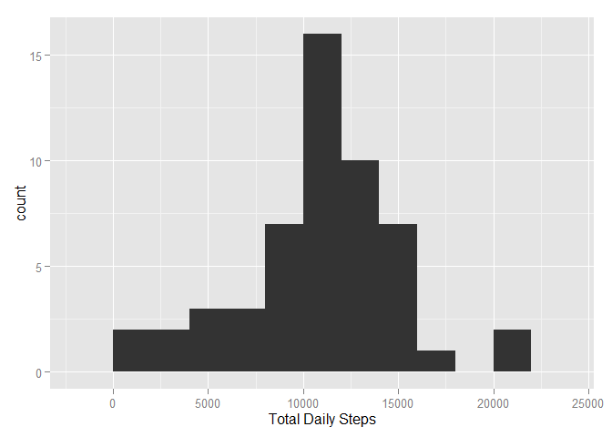
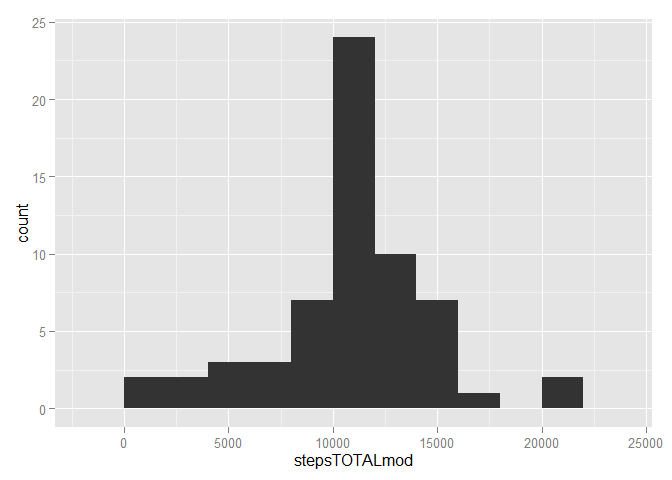

# Reproducible Research: Peer Assessment 1
Jawad Mroueh  
January 7, 2016  

Personal activity monitor data for the months of October and November, 2012. Number of steps taken in 5 minute intervals each day.

## Loading and preprocessing the data
The dplyr and ggplot2 libraries are used in this project to summarize and plot the data.
First the data is loaded and the date variable is cleaned up in the dataframe


```r
library(dplyr)
```

```
## Warning: package 'dplyr' was built under R version 3.2.2
```

```
## 
## Attaching package: 'dplyr'
## 
## The following objects are masked from 'package:stats':
## 
##     filter, lag
## 
## The following objects are masked from 'package:base':
## 
##     intersect, setdiff, setequal, union
```

```r
library(ggplot2)
activityDATA <- read.csv("./activity.csv")
activityDATA$date <- as.Date(activityDATA$date)
```
## What is mean total number of steps taken per day?
The total and mean daily steps are calculated for each day using the pipeline operator %>%, group_by and summarise functions. A Histogram of the total number of steps taken each day is shown below. Also the Mean and median number of steps taken each day are outputed below.


```r
# Daily summary statistics
activityDAILY <- activityDATA %>% group_by(date)        # grouped activity by date
stepsDAILY <- summarise(activityDAILY, stepsTOTAL = sum(steps), stepsMEAN = mean(steps))     
qplot(stepsTOTAL, data=stepsDAILY, binwidth = 2000, xlab = "Total Daily Steps") 
```

 

```r
dailymean <- mean(stepsDAILY$stepsTOTAL, na.rm = T)                  # Total Daily steps average
dailymed <- median(stepsDAILY$stepsTOTAL, na.rm = T)                # Total Daily steps median
A <- matrix(c(dailymean, dailymed),2,1)
dimnames(A) = list(c("mean", "median")) 
print(A)
```

```
##            [,1]
## mean   10766.19
## median 10765.00
```

## What is the average daily activity pattern?
To average the number of steps for each interval over the two months period, the same method of group_by was used but on the interval variable. Then a timeseries is created by plotting the interval versus the mean steps while removing NA data, the graph is outputed below. which.max is used to find the interval with the highest average number of steps, the interval is outputed below.

```r
# Average Daily activity Pattern
activityINT <- activityDATA %>% group_by(interval)
stepsINT <- summarise(activityINT, stepsMEAN = mean(steps,na.rm = T))
qplot(interval, stepsMEAN, data = stepsINT, geom = c("point", "line"))
```

 

```r
maxindex <- which.max(stepsINT$stepsMEAN)               # finds index of maximum average steps per interval
stepsINT$interval[maxindex]                             # Returns time interval of maximum steps activity
```

```
## [1] 835
```

## Imputing missing values
For missing values, the code below was used and outputs total number of missing row values. then plots the number of missing values for each day to understand where the missing values are.

```r
# Review Missing values
sum(is.na(activityDATA$steps))                          # Counts number of NA in steps variable               
```

```
## [1] 2304
```

```r
NAcount <- summarise(activityDAILY, nacount = sum(is.na(steps)))       
with(NAcount, plot(date, nacount))                      # Examine number of missing values for each date
```

 

```r
length(NAcount$nacount[NAcount$nacount==0])             # counts dates with complete cases
```

```
## [1] 53
```
Examining the NA shows that the days where data exists are complete without missing values, therefore it is best to use the 5 min average interval data to replace the missing days. The mean and median of the modified dataframe are calculated and outputed.

```r
NAindex <- which(is.na(activityDATA$steps))             # index rows of missing values in original df
intervalMEAN <- rep(stepsINT$stepsMEAN,8)               # creates a repeated vector of the average daily steps for 8 days
activityDATAmod <- activityDATA                      # copies original df 
activityDATAmod[NAindex,1] <- intervalMEAN              # replaces misssing days steps with the average vector

# Modified DataFrame Daily summary statistics
activityDAILYmod <- activityDATAmod %>% group_by(date)        # grouped activity by date
stepsDAILYmod <- summarise(activityDAILYmod, stepsTOTALmod = sum(steps), stepsMEANmod = mean(steps))     
qplot(stepsTOTALmod, data=stepsDAILYmod, binwidth = 2000)     # Histogram of daily total steps
```

 

```r
dailymeanmod <- mean(stepsDAILYmod$stepsTOTAL)                                # Total Daily steps average
dailymedmod <- median(stepsDAILYmod$stepsTOTAL)                                # Total Daily steps median
B <- matrix(c(dailymeanmod, dailymedmod),2,1)
dimnames(B) = list(c("mean mod", "median mod")) 
print(B)
```

```
##                [,1]
## mean mod   10766.19
## median mod 10766.19
```
Because we have replaced all the missing days with the average daily activities, we have replicated so many of the same average datapoint which makes the median equal to the mean in this particular example.

## Are there differences in activity patterns between weekdays and weekends?
A factor variable is added to the modified dataframe to differentiate between weekday and weekend, the data is plotted using qplot and a facets based on type of day.

```r
# weekday activity
activityDATAmod$wkday <- ifelse(weekdays(activityDATAmod$date) == "Saturday" | weekdays(activityDATAmod$date) =="Sunday","weekend", "weekday")
activityDATAmod$wkday <- as.factor(activityDATAmod$wkday)

# Average Daily activity Pattern weekday vs weekend
activityINTmod <- activityDATAmod %>% group_by(interval,wkday)
stepsINTmod <- summarise(activityINTmod, stepsMEAN = mean(steps))
qplot(interval, stepsMEAN, data = stepsINTmod, geom = c("point", "line"), facets = wkday~., ylab = "Number of steps", main = "Activity 5 min interval summary")
```

 

We can see from the plot that the behavior is a little different on the weekend where the activity is more spread out through the day.
